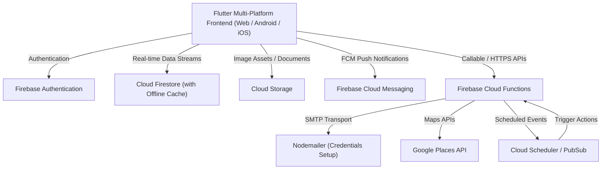
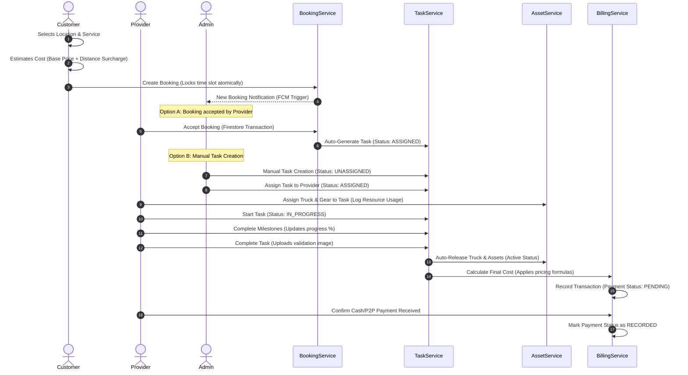

# DUALSERVE Complete System Architecture & Walkthrough

DUALSERVE is a state-of-the-art, multi-role hybrid service marketplace designed for **Household and Towing Services**. Built on top of a highly responsive, high-performance architecture, the system leverages a **Flutter multi-platform application** as the frontend, and a serverless **Firebase backend** as the core engine.

This walkthrough outlines the complete design, workflows, services, functions, and models that compose the entire DUALSERVE ecosystem.

---

## 1. System Overview & Technology Stack

DUALSERVE uses a state-of-the-art serverless architecture to guarantee real-time reactivity, high availability, offline availability, and military-grade transactional consistency.



### 1.1 Core Frontend Tech Stack
*   **Framework:** Flutter (Dart) for high-fidelity Android, iOS, and PWA compilation.
*   **State Management:** `Provider` coupled with `ChangeNotifier` for reactive, optimized local state propagation.
*   **Theme Engine:** Dual-mode (Light & Dark HSL-based palettes) built using sleek material utilities.
*   **Offline Support:** Active offline Firestore cache integration to permit incident drafting and offline profile reading.

### 1.2 Core Backend Tech Stack
*   **Database:** Cloud Firestore (document-oriented real-time database).
*   **Auth Engine:** Firebase Auth supporting Custom Claims (e.g., administrator privileges).
*   **File Storage:** Firebase Storage with security policies for provider driver documents, verification paperwork, and completion proof images.
*   **Serverless Layer:** Firebase Cloud Functions (Node.js/Express-based environment) for secure transactions, scheduling, and third-party APIs.

---

## 2. Core Workflows & Lifecycles

The core business flow moves from a customer request (Booking) to administrator planning (Task with Assets) and provider work execution (Task In Progress), culminating in final payment processing (Transaction).



---

## 3. Data Dictionary (Collections & Firestore Schema)

### 3.1 Users (`users/{uid}`)
Contains primary user profile cards, defining credentials, role levels, and basic profile configuration.

| Field | Type | Description |
| :--- | :--- | :--- |
| `uid` | String | Unique Authentication ID. |
| `name` | String | User's full name. |
| `email` | String | Primary email address (lowercased). |
| `phone` | String | Contact number. |
| `role` | String | User role: `customer`, `provider`, `admin`, `pending_provider`. |
| `isEmailVerified` | Boolean | True if user has verified email. |
| `createdAt` | Timestamp | Date of registration. |
| `updatedAt` | Timestamp | Date of last modifications. |

### 3.2 Providers (`providers/{uid}`)
Provider-specific extensions referencing the base user document ID.

| Field | Type | Description |
| :--- | :--- | :--- |
| `uid` | String | Matches the user document ID. |
| `serviceType` | String | Main service vertical (`Household` or `Towing`). |
| `specialty` | String | Highlight sub-discipline. |
| `status` | String | Online availability: `available`, `busy`, `offline`. |
| `rating` | Double | Average review score (out of 5.0). |
| `jobsCompleted` | Integer | Total tasks successfully finalized. |
| `weeklySchedule` | Map | Daily availability slots map (`DayOfWeek -> TimeSlotsList`). |
| `blockOutDates` | Array\<String\> | List of ISO date strings when provider is unavailable. |
| `maxTasksPerDay` | Integer | Rate limiting threshold for automatic task scheduling. |

### 3.3 Bookings (`bookings/{bookingId}`)
Represents customer reservations or manual schedule blocks before they are converted into actual on-site tasks.

| Field | Type | Description |
| :--- | :--- | :--- |
| `customerId` | String | Referencing the ordering customer. |
| `assignedProviderId`| String (Nullable) | Selected provider ID, or empty for open pooling. |
| `serviceType` | String | Requested category (`Household` or `Towing`). |
| `address` | String | Destination coordinates text label. |
| `latitude` / `longitude` | Double | Precision GIS routing pins. |
| `status` | String | Lifecycle status: `pending`, `accepted`, `rejected`, `converted_to_task`, `cancelled`, `expired`. |
| `scheduledDate` | Timestamp | Intended day of performance. |
| `scheduledTime` | String | Time-slot selection text. |
| `estimatedCost` | Double | Initially estimated rate displayed to user. |
| `cancellationFee` | Double | Applied surcharge if cancelled after grace timeout. |

### 3.4 Tasks (`tasks/{taskId}`)
Represents operational deployment orders that providers actively execute on-site.

| Field | Type | Description |
| :--- | :--- | :--- |
| `customerId` | String | Client requesting the service. |
| `assignedProviderId`| String | Worker responsible for execution. |
| `serviceType` | String | Execution vertical. |
| `location` | String | Text address of scene. |
| `latitude` / `longitude` | Double | GIS routing coordinates. |
| `priority` | String | Operational urgency: `low`, `medium`, `high`, `urgent`. |
| `status` | String | Status: `unassigned`, `assigned`, `inProgress`, `completed`, `cancelled`. |
| `progress` | Double | Execution progress value (0.0 to 1.0). |
| `milestones` | Array\<Map\> | Structured step markers (e.g., `En Route`, `Arrived`). |
| `assignedTruckId` | String (Nullable) | Heavy vehicle asset assigned to the job. |
| `assignedAssets` | Map\<String, Int\>| List of tools/consumables locked for the job. |

### 3.5 Assets (`assets/{assetId}`)
Global equipment register. Tracks tools, consumable inventory, and commercial vehicles.

| Field | Type | Description |
| :--- | :--- | :--- |
| `id` | String | Autogenerated ID. |
| `name` | String | Equipment descriptor. |
| `category` | String | Functional category. |
| `type` | String | Classification: `vehicle`, `tool`, `equipment`. |
| `status` | String | Status: `active`, `maintenance`, `inactive`, `inUse`. |
| `quantity` | Integer | Remaining available inventory count (for tools/consumables). |
| `assignedTo` | String (Nullable) | Provider UID holding the asset. |
| `currentTaskId` | String (Nullable)| Locked Task ID if asset is checked out on a job. |

### 3.6 Transactions (`transactions/{transactionId}`)
Audited financial ledgers. Unmodifiable accounting records generated upon job completion.

| Field | Type | Description |
| :--- | :--- | :--- |
| `taskId` / `bookingId`| String | Referenced execution objects. |
| `customerId` / `providerId`| String | Ledger parties. |
| `basePrice` | Double | Base price for the service. |
| `distanceSurcharge` | Double | Mileage calculation fee. |
| `nightDifferential` | Double | Surcharge for overnight work. |
| `additionalCost` | Double | Provider manual surcharge (e.g., tools, extra materials). |
| `finalCost` | Double | Grand total charged. |
| `paymentStatus` | String | Financial resolution: `pending` or `recorded`. |

---

## 4. Firebase Cloud Functions (`functions/index.js`)

DUALSERVE's Cloud Functions manage critical operations, background calculations, and sensitive actions that must never be exposed to client-side manipulation.

### 4.1 Custom Claims Provisioning (`setAdminRole`)
*   **Purpose:** Ensures high-security boundary controls.
*   **Trigger:** HTTPS Callable.
*   **Process:**
    1. Validates that the executing user contains the administrative claim (`context.auth.token.admin === true`).
    2. Validates existence of targeted user using `admin.auth().getUser(targetUid)`.
    3. Provisions custom claims payload `{ admin: true }` to Firebase Auth token metadata.
    4. Synchronizes base `users` profile collection document by setting `'role': 'admin'`.
    5. Dispatches un-maskable entries to the audited systems ledger collection (`_system/auditLogs`).

### 4.2 Secure Provider Account Creator (`createProvider`)
*   **Purpose:** Secure, administrative-driven worker enrollment.
*   **Trigger:** HTTPS Callable (strictly restricted to administrators).
*   **Process:**
    1. Asserts caller is authenticated and rate limits action via `checkRateLimit` (10 calls per 15 minutes max per administrator to prevent scripting abuse).
    2. Enforces structure schemas: validates email, checks phone pattern, and ensures service classification is `Household` or `Towing`.
    3. Asserts the email does not exist in Firebase Authentication records.
    4. Creates Auth credentials using an autogenerated secure temporary password.
    5. Initializes profile documents in both the global `users` collection and the specialized `providers` inventory.
    6. Generates a secure, expiring (24-hour) password setup link through `admin.auth().generatePasswordResetLink(email)`.
    7. Uses SMTP (Nodemailer) and a HTML template from `emailTemplates.js` to send a professional welcome message containing the configuration links.
    8. Records a success audit trace in `_system/auditLogs` documenting the setup parameters.

### 4.3 Google Places Proxy (`getAddressPredictions`)
*   **Purpose:** Low-latency autocomplete address query engine.
*   **Trigger:** HTTPS Callable.
*   **Process:**
    1. Proxies query payloads directly into Google Maps Place Autocomplete API.
    2. Enforces regional scoping limits (Philippine territories: `components: "country:ph"`).
    3. Hides API key credentials on the server, avoiding exposures on mobile devices.

### 4.4 Automated Daily Scheduler (`convertAcceptedBookingsToTasks`)
*   **Purpose:** Daily scheduling job.
*   **Trigger:** PubSub Cron Engine (`0 0 * * *` - Midnight, Manila local timezone).
*   **Process:**
    1. Queries all accepted bookings scheduled for the current day.
    2. Converts booking records into runnable `tasks` (assigned status).
    3. Switches booking status fields to `converted_to_task` to prevent double processing.

### 4.5 Reactive Push Notifications (`onBookingCreated` & `onBookingStatusChanged`)
*   **Purpose:** Background FCM broadcasts.
*   **Trigger:** Firestore document triggers (`onCreate` / `onUpdate` on `bookings/{id}`).
*   **Process:**
    1. Resolves targeted profile user documents to retrieve client registration keys (`fcmToken`).
    2. Constructs localized messaging payloads with appropriate deep-linking tags.
    3. Dispatches signals via Firebase Cloud Messaging (`admin.messaging().send()`).

### 4.6 Booking Garbage Collector (`autoRejectExpiredBookings`)
*   **Purpose:** Automatically cleans up orphaned, un-actioned booking requests.
*   **Trigger:** Cloud Scheduler Cron (Runs every 5 minutes).
*   **Process:**
    1. Queries all booking requests holding `status: 'pending'` with age values exceeding 30 minutes.
    2. Transitions their status values to `expired`.
    3. Releases time slots atomically so other clients can request services.

---

## 5. Flutter Core Services Architecture (`lib/services/`)

### 5.1 `BookingService` (Booking Management)
Manages reservations, slot locks, and transitions from booking requests to tasks.

```dart
// Key Methods:
Future<String> createBooking(Booking booking);
Future<void> acceptBooking(String bookingId, String providerId);
Future<void> rejectBooking(String bookingId);
Future<void> cancelBooking(String bookingId);
Stream<List<Booking>> getCustomerBookings(String customerId);
Stream<List<Booking>> getProviderBookings(String providerId);
```
*   **Atomic Time Slot Locking:** Uses document transactions to create a unique slot reservation: `provider_slots/{providerId}_{dateISO}_{timeSlot}`. This completely blocks double bookings at the database level.
*   **Booking Acceptance Transaction:** Accepts bookings inside an atomic Firestore `runTransaction` block. It checks the booking's status, creates a new Task with matching metadata, and updates the booking to `converted_to_task` in a single atomic database operation.
*   **Cancellation Grace Period & Protection Fees:** If a user cancels an accepted booking after the grace period of 5 minutes (`PricingConfig.cancellationGracePeriodMinutes`), a fee of 100 PHP (`PricingConfig.cancellationFee`) is automatically charged.

### 5.2 `TaskService` (Task Lifecycle)
Coordinates field operations, milestones, progress updates, and asset tracking.

```dart
// Key Methods:
Future<String> createTask(Task task);
Stream<List<Task>> getProviderTasks(String providerId);
Future<void> updateTaskStatus(String taskId, TaskStatus status);
Future<void> updateTaskMilestone(String taskId, String milestoneId, bool isCompleted);
Future<void> updateTaskCompletion(String taskId, {String? imageUrl, String? bookingId});
Future<void> cancelTask(String taskId, {String? bookingId, String? reason});
```
*   **Dynamic Milestones & Progress Tracking:** Automatically injects standard milestoning chains based on the service type (e.g., `En Route` -> `Arrived` -> `Loaded` for Towing; `Dispatched` -> `Setup` -> `In Progress` -> `Inspection` for Household). It recalculates progress fractions in real-time whenever a milestone state transitions.
*   **Atomic Inventory Auto-Release:** When `updateTaskCompletion` or `cancelTask` is triggered, it automatically releases checked-out assets (trucks, tools, and equipment) back to `active` status and increments consumable/tool counts in the global register, avoiding stuck inventory logs.

### 5.3 `BillingService` (Financial Calculations)
The auditing ledger system. Calculates costs and records transactions.

```dart
// Key Methods:
double estimateCost(String serviceType, double sLat, double sLng, double dLat, double dLng);
Future<Map<String, double>> calculateCostWithProviderPricing({...});
Future<String> recordTransaction({...});
Future<void> updatePaymentStatus(String transactionId, PaymentStatus paymentStatus);
```
*   **Pricing Formula Execution:** Applied dynamically on-the-fly:
    $$\text{Final Cost} = \text{Base Price} + \text{Night Surcharge} + \text{Distance Surcharge} + \text{Provider Adjustments}$$
    *   *Base Fare:* Towing = 1500 PHP, Household = 500 PHP.
    *   *Distance Surcharge:* 0-10km included in the base price; 120 PHP per kilometer is charged for distances exceeding 10km.
    *   *Night Differential:* 30% surcharge applied to the base price for works between 11:00 PM and 5:00 AM local time.
*   **Atomic Cash/P2P Confirmation Ledger:** Creates immutable transaction ledger records, retaining details about the transaction, billing parties, and payment state, which is updated via physical provider validation.

### 5.4 `AssetService` (Inventory Control)
Manages heavy machinery, vehicles, tools, and usage audits.

```dart
// Key Methods:
Stream<List<AssetModel>> getAssets();
Future<void> logResourceUsage({...});
Future<void> claimAssetForProvider(String assetId, String providerId, String providerName);
Future<void> releaseAsset(String assetId);
```
*   **Operational Resource Logging:** Allows providers to assign crew members, drivers, vehicles, and tool combinations to a job. It updates task metadata and subtracts tools/consumables from the warehouse inventory dynamically.
*   **Security Permission Boundaries:** Handles fleet management permissions securely. If an asset is a shared fleet vehicle, it handles the write permissions gracefully using isolated try-catch blocks to prevent permission errors from blocking the task flow.

### 5.5 Supporting Micro-Services
*   **`LocationService`:** Calculates geographic distances using the Haversine formula and handles coordinate tracking.
*   **`ChatService`:** Provides real-time messaging capabilities within active bookings or tasks.
*   **`NotificationService`:** Configures and registers Firebase Cloud Messaging tokens, sending high-priority alerts to users.
*   **`ProviderPricingService`:** Manages custom rates, night differentials, and pricing multipliers configured by providers.
*   **`RoutingService`:** Fetches routing geometry and directional steps for real-time map tracking.
*   **`StorageService`:** Handles secure media uploads (such as incident profiles, driver verification files, and proof images).

---

## 6. Frontend State Management (`UserProvider`)

State management uses Flutter's `Provider` and `ChangeNotifier` to manage user sessions and themes across the application.

```dart
class UserProvider with ChangeNotifier {
  Map<String, dynamic>? _userProfile;     // Base user record
  Map<String, dynamic>? _providerProfile; // Provider metadata (schedule, rating)
  String? _role;                          // Role label (admin, customer, etc.)
  bool _isDarkMode = false;               // Local theme choice
  bool _isLoading = false;                // Activity indicator flag
  
  // Getters, theme triggers, and async loading commands...
}
```

### 6.1 Authentication Bootstrapping Flow
On application boot, the root MaterialApp mounts an `AuthWrapper` connected to FirebaseAuth's auth state stream:

```
                  App Launch
                      │
                      ▼
         StreamBuilder (AuthState)
           /                   \
      (Logged Out)          (Logged In)
         /                       \
        ▼                         ▼
   LoginScreen             Load Profile Data
                           Initialize Services (FCM)
                                  │
                                  ▼
                         RoleBasedHome Router
                        /          |         \
                   (Admin)    (Provider)  (Customer)
                     /             |           \
                    ▼              ▼            ▼
               AdminHome     ProviderMain   CustomerMain
```

### 6.2 Key State Lifecycle Functions
*   **`loadCurrentUserData()`:** Triggers when the active user changes. It fetches the user's role from the database, loads the core user profile, and retrieves additional provider metadata if the user is a service worker.
*   **`toggleAvailability(bool)`:** Provides an optimistic UI experience for workers toggling their online availability. It updates the UI immediately and reverts the change if the database write fails.
*   **`toggleTheme()`:** Toggles between light and dark modes, persisting the user's preference locally using `SharedPreferences`.

---

## 7. Complete UI Architecture Map

### 7.1 Customer Space (`lib/screens/customer/`)
*   **`CustomerMainLayout`:** Contains bottom navigation controls routing to active views.
*   **`CustomerHome`:** Offers a clean, grid-based dashboard for quick access to booking forms.
*   **`BookingScreen`:** Includes booking selection forms with distance calculations and real-time pricing estimates.
*   **`CustomerTrackingScreen` / `ServiceTracking`:** Displays active services, current milestones, and live map tracking.
*   **`BillingHistoryScreen`:** Shows invoice lists, cost breakdowns, and receipts.

### 7.2 Provider Space (`lib/screens/provider/`)
*   **`ProviderMainLayout`:** Provides navigation tools for active duties, schedules, and assets.
*   **`ProviderTasksScreen`:** An operational kanban dashboard showing assigned, in-progress, and completed tasks.
*   **`BookingAssetAssignmentScreen`:** Allows providers to assign vehicles, tools, and crew members to a job before starting work.
*   **`TransactionCompletionScreen`:** Shows calculated costs, handles custom provider price adjustments, and records cash or digital payments.
*   **`ProviderAvailabilityScreen` / `ScheduleScreen`:** Allows providers to manage their working hours and block out specific dates.
*   **`ProviderAssetInventoryScreen`:** Allows providers to register and manage their own equipment or check out shared fleet vehicles.

### 7.3 Administrator Space (`lib/screens/admin/`)
*   **`AdminHome`:** The main control center containing operational summaries and navigation menus.
*   **`DashboardPage`:** Displays real-time operational graphs, active jobs, and system statistics.
*   **`TaskAssignmentPage`:** Allows administrators to manage, assign, and dispatch unassigned tasks to available providers.
*   **`CreateTaskPage`:** Allows administrators to manually create and dispatch new tasks directly from the backend.
*   **`AssetsPage`:** Allows administrators to register, manage, and assign fleet vehicles and tools.
*   **`ProvidersPage`:** Allows administrators to review, verify, and approve provider registration documents.
*   **`UsersPage`:** Allows administrators to view user profiles, manage roles, and review system access logs.
